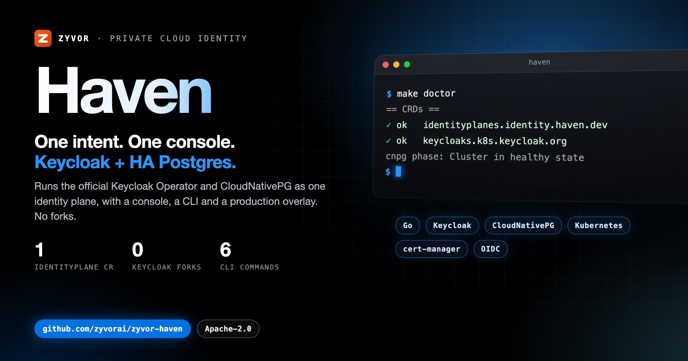
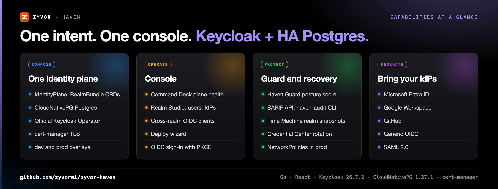
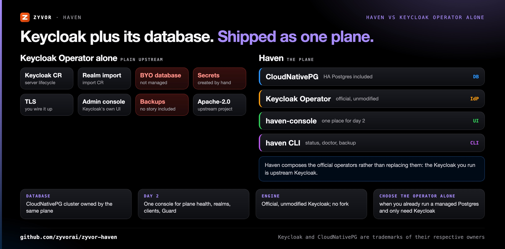
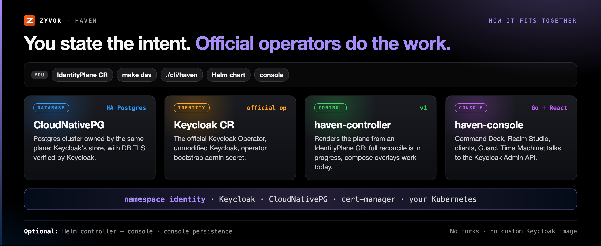

<div align="center">

# Haven

[](https://github.com/zyvorai/zyvor-haven/actions/workflows/ci.yml)
[](LICENSE)
[](go.mod)
[](https://zyvorai.github.io/zyvor-haven/)
[](versions.env)
[](versions.env)
[](CHANGELOG.md)

[](https://zyvor.dev/schedule?utm_source=github&utm_medium=haven&utm_campaign=readme_hero)
[](https://zyvor.dev/poc?utm_source=github&utm_medium=haven&utm_campaign=readme_hero)
[](#quickstart)



### Identity for the private cloud.

**One intent. One console. Official Keycloak + HA Postgres that actually ship together.** A small packaging and operations layer over the official Keycloak Operator and CloudNativePG — not a replacement IdP, not managed SaaS, not a Keycloak fork.

**Official Keycloak Operator** · **CloudNativePG HA Postgres** · **0 Keycloak forks** · **One console** · **Apache-2.0**

[Console](docs/console.md) · [Docs](https://zyvorai.github.io/zyvor-haven/) · [Production](#production-overlay) · [License](#license)

</div>

---

## What's new

On `main`, not yet in a tagged release (see [CHANGELOG.md](CHANGELOG.md)):

| Feature | What it does |
|---|---|
| **Haven Guard** | Deterministic OIDC/Keycloak security posture scoring and drift detection: a live `/api/v1/security/posture` + SARIF API, an offline `haven-audit` CI CLI, and a console Guard page |
| **Time Machine** | Immutable per-realm recovery points with drift diff (clients, users, roles, groups, IdPs, access bindings) and safe restore into a new realm |
| **Credential Center** | Confidential-client secret inventory, rotation with overlap detection, and explicit retirement, never exposing the previous secret |
| **Federation Hub** | Guided onboarding for Microsoft Entra ID, Google Workspace, GitHub, generic OIDC and SAML 2.0, with secret/certificate redaction on every response |
| **Console persistence** | Optional persistent console volume (`console.persistence`) for durable Time Machine history, restricted to `console.replicas=1` |

<a id="why-haven"></a>

## Why Haven

The official Keycloak Operator runs Keycloak well. It **does not** manage the database. That gap is where production identity dies.

| When this happens… | Haven gives you… |
|---|---|
| The database is "bring your own": a Bitnami chart, a random StatefulSet, a forgotten RDS URL | A CloudNativePG cluster owned by the same plane |
| Secrets are tribal knowledge, `kubectl create secret` pasted in Slack | Secrets generated, rotated and referenced automatically |
| First boot is a scavenger hunt: hunt `-initial-admin`, guess the hostname, fight TLS | A wizard, a ready URL and the operator bootstrap secret |
| Day 2 is two UIs and a prayer: kubectl plus Keycloak admin, no backup story | One console: plane health, DB, realms, clients, backups |
| A multi-tenant private cloud runs one Keycloak with many undocumented realms | Realms as first-class tenants with platform OIDC clients |
| Nobody can say whether the realms are configured safely | Haven Guard posture scoring, drift detection and SARIF for CI |



<a id="is-this-for-you"></a>Haven composes the **official** CloudNativePG and the **official** Keycloak Operator. No forks. No custom Keycloak image required for v0. How it compares with Auth0, Okta, Authentik, Zitadel and Cognito: [docs/why-haven.md](docs/why-haven.md).

---

## Haven vs Keycloak Operator alone



| | **Haven** | **Plain Keycloak Operator** |
|---|---|---|
| Primary scope | Keycloak + HA Postgres as one plane | Keycloak lifecycle only — BYO database |
| Database included | Yes — CloudNativePG | No |
| Identity engine | Keycloak (official, unmodified) | Keycloak |
| Secrets and first boot | Generated secrets, deploy wizard, ready URL, bootstrap secret | Created and wired by you |
| Day-2 operations | One console (Command Deck, Realm Studio, clients) plus `./cli/haven` status, doctor, backup | `kubectl` and the Keycloak admin console |
| Security posture | Haven Guard scoring, drift detection, `haven-audit` for CI | Not part of the operator |
| License | Apache-2.0 | Apache-2.0 (Keycloak) |
| **Choose the operator alone when** | | You already run a managed Postgres you trust, and you only need Keycloak's lifecycle handled |

*(General characterizations as of writing — verify against each project's own docs.)* Haven is pre-1.0; see [Maturity](#maturity).

---

## How it fits together



<a id="what-you-get"></a>

<a id="console"></a>

<table>
<tr>
<td valign="top" width="33%">
<b>IdentityPlane</b><br>
One CR for Postgres + Keycloak + certs + ingress (controller path in v1).<br>
<a href="docs/architecture.md">Architecture</a>
</td>
<td valign="top" width="33%">
<b>Compose today</b><br>
<code>deploy/overlays/{dev,prod}</code> are the exact manifests the controller will render.<br>
<a href="docs/what-you-get.md">Components</a>
</td>
<td valign="top" width="33%">
<b>Command Deck</b><br>
Live plane and Keycloak health in one glass.<br>
<a href="docs/console.md">Console: routes and auth</a>
</td>
</tr>
<tr>
<td valign="top" width="33%">
<b>Realm Studio</b><br>
Realms, users, clients and IdPs without living in the Keycloak admin UI.<br>
<a href="docs/console.md">Console</a>
</td>
<td valign="top" width="33%">
<b>CLI</b><br>
<code>deploy</code>, <code>status</code>, <code>doctor</code>, <code>admin</code>, <code>backup</code>.<br>
<a href="docs/cli.md">CLI</a>
</td>
<td valign="top" width="33%">
<b>Private-cloud defaults</b><br>
NetworkPolicies, TLS and metrics on in <code>production</code>.<br>
<a href="docs/security-posture.md">Security posture</a>
</td>
</tr>
</table>

```text
  you ──► IdentityPlane CR ──► Haven controller (v1)
                                   │
                    ┌──────────────┼──────────────┐
                    ▼              ▼              ▼
              CloudNativePG   Keycloak CR    Certs + Gateway
              (HA Postgres)   (official op)  (cert-manager)

  v0 compose path: deploy/overlays/{dev,prod}  (no controller required)
```

**Scope:** Haven deploys and operates Keycloak + PostgreSQL (CloudNativePG). It is **not** an AI agent or app-data tool — the Postgres cluster is Keycloak’s store, not your app OLTP. Pinned versions: [`versions.env`](versions.env). Design principles: [docs/what-you-get.md](docs/what-you-get.md).

---

<a id="quick-start"></a>

## Quickstart

```bash
git clone https://github.com/zyvorai/zyvor-haven.git
cd zyvor-haven

# 1. Operators (once per cluster)
./deploy/operators/install.sh

# 2. Postgres + Keycloak
make dev
make wait
make doctor
make admin
```

| | |
|---|---|
| Keycloak Admin | `http://auth.127.0.0.1.nip.io/admin` |
| Bootstrap secret | `platform-initial-admin` in namespace `identity` |
| First realm | `make realm-import` (optional) |

Requirements: a Kubernetes cluster you can install operators into; pinned versions of CloudNativePG, the Keycloak Operator and cert-manager are in [`versions.env`](versions.env). Remote lab console and the local UI: [docs/quick-start.md](docs/quick-start.md). First deploy in depth: [docs/getting-started.md](docs/getting-started.md).

<a id="install-with-helm"></a>

## Install with Helm

```bash
helm install haven oci://ghcr.io/zyvorai/charts/haven --version 0.1.0 \
  --set controller.enabled=true \
  --set console.enabled=true
```

Images: `ghcr.io/zyvorai/haven-console:0.1.0` · `ghcr.io/zyvorai/haven-controller:0.1.0`. Controller and console default to `enabled: false`; chart installs RBAC by default. Details: [docs/install-helm.md](docs/install-helm.md).

<a id="production-overlay"></a>

## Production overlay

`deploy/overlays/prod` is a shape, not a one-liner. Read [docs/production-overlay.md](docs/production-overlay.md) before apply:

1. `./hack/gen-prod-secrets.sh` — do not use the placeholder password
2. Wait for CNPG, then `./hack/sync-cnpg-ca.sh` (Keycloak verifies DB TLS)
3. Issue `platform-tls` from your ClusterIssuer
4. Configure backups separately ([docs/backups.md](docs/backups.md))

<a id="documentation"></a>

## Documentation

| Doc | When to read |
|---|---|
| [zyvorai.github.io/zyvor-haven](https://zyvorai.github.io/zyvor-haven/) | Product docs |
| [docs/faq.md](docs/faq.md) | Deciding whether to adopt |
| [docs/getting-started.md](docs/getting-started.md) | First deploy |
| [docs/troubleshooting.md](docs/troubleshooting.md) | Real operational issues |
| [docs/architecture.md](docs/architecture.md) | CRDs, reconcile order |
| [docs/roadmap.md](docs/roadmap.md) | v0 / v1 / v2 scope |

Every page, with the comparison and design principles: [docs/documentation-map.md](docs/documentation-map.md). Social assets: [docs/social/](docs/social/).

---

## Maturity

> **Maturity (honest):** repository framed as **v0** — compose overlays, CLI, and CRDs are defined; Helm today “installs RBAC only (controller/console images unpublished)” until you opt in. Full Kubebuilder reconcile is v1, in progress. Production overlay is “a shape, not a one-command install.” Tagged release: `0.1.0`. See [docs/roadmap.md](docs/roadmap.md).

| | Status |
|---|---|
| Compose overlays (CNPG + official Keycloak Operator), CLI, CRDs, `KeycloakRealmImport` sample | v0, in this repository |
| Controller, console (Command Deck, Planes, Atlas, Realm Studio, Clients, Settings), console OIDC | v1, in progress |
| Full Kubebuilder reconcile of CNPG + Keycloak Operator + cert-manager; `reclaimPolicy` finalizer | v1, remaining |
| Guard, Time Machine, Credential Center, Federation Hub | On `main`, unreleased |
| Multi-site status, backup restore wizard, Zeus OS Identity Center embed | v2 roadmap |

---

## Part of the Zyvor stack

| Product | Role next to Haven |
|---|---|
| **Haven** | Private-cloud identity: Keycloak + HA Postgres as one plane |
| **[Zorvia](https://github.com/zyvorai/zyvor-zorvia)** | Pairs with Haven on the same private-cloud Kubernetes: KubeVirt VMs next to the identity plane |
| **[Kairo](https://github.com/zyvorai/kairo)** | Pairs with Haven on the same clusters: previews the blast radius of Kubernetes manifest changes before deploy |
| **[Zeus OS](https://zyvor.dev/zeus-os?utm_source=github&utm_medium=haven&utm_campaign=readme_suite)** | An Identity Center embed (shared OIDC session) is on Haven's v2 roadmap |

→ [zyvor.dev](https://zyvor.dev)

---

## License

Haven is **free and open source** under the [Apache License, Version 2.0](LICENSE). Personal, lab, and commercial production use at no charge, subject to Apache-2.0 (preserve notices / NOTICE where required). See [NOTICE](NOTICE) for third-party attribution (Keycloak and CloudNativePG remain under their own licenses). That does not change.

**Zyvor Enterprise** adds what production teams ask for: supported releases, deployment and upgrade guidance, priority incident triage, a named technical contact and 24x7 critical intake. Production support, SLAs, and Zyvor Enterprise products are licensed separately. Plans and terms: [docs/SUBSCRIPTION-MODEL.md](docs/SUBSCRIPTION-MODEL.md) · [Pricing](https://zyvor.dev/pricing?utm_source=github&utm_medium=haven&utm_campaign=readme_license) · [sales@zyvor.dev](mailto:sales@zyvor.dev).

Contributions: [CONTRIBUTING.md](CONTRIBUTING.md). Report vulnerabilities privately per [SECURITY.md](SECURITY.md).

---

<div align="center">

### Run identity your private cloud can depend on

[](https://zyvor.dev/schedule?utm_source=github&utm_medium=haven&utm_campaign=readme_footer)
[](https://zyvor.dev/poc?utm_source=github&utm_medium=haven&utm_campaign=readme_footer)
[](https://zyvor.dev/pricing?utm_source=github&utm_medium=haven&utm_campaign=readme_footer)
[](mailto:sales@zyvor.dev?subject=Haven)
[](https://github.com/zyvorai/zyvor-haven)

</div>
